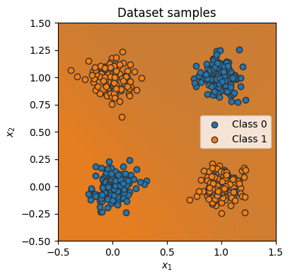
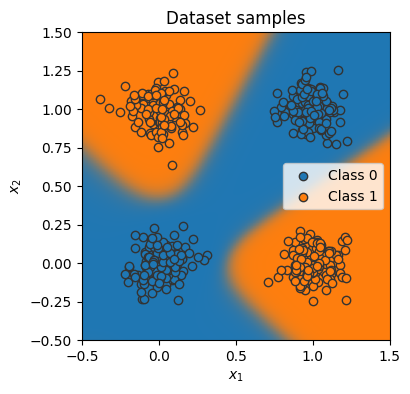

```python
%matplotlib inline
from dataset import XORDataset, visualize_samples, visualize_classification
import matplotlib.pyplot as plt
import torch.utils.data as data
from simple_nn import SimpleClassifier, GradientDescent
import torch
from train_nn import train_model, eval_model
```


```python

num_inputs = 2
num_hidden = 4
num_outputs = 1

train_dataset = XORDataset(size=2500)
train_data_loader = data.DataLoader(train_dataset, batch_size=128, shuffle=True)

test_dataset = XORDataset(size=500)
test_data_loader = data.DataLoader(
    test_dataset, batch_size=128, shuffle=False, drop_last=False
)


model = SimpleClassifier(num_inputs, num_hidden, num_outputs)
device = torch.device("cuda") if torch.cuda.is_available() else torch.device
optimizer = GradientDescent(lr=0.01)
```


```python
_ = visualize_classification(model, test_dataset.data, test_dataset.label)
```


    

    


```python
train_model(model, train_data_loader)
eval_model(model, test_data_loader)
_ = visualize_classification(model, test_dataset.data, test_dataset.label)
```

    Accuracy of the model: 100.00%


    

    

